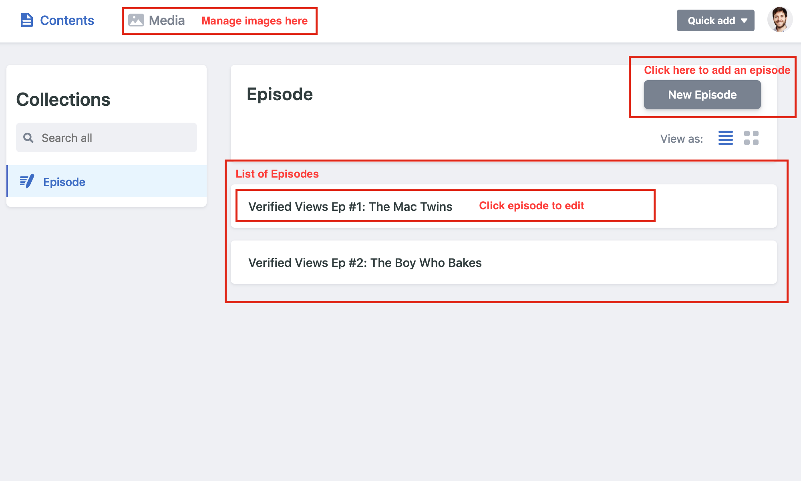

  

<h1 align="center">
  🎤 #VerifiedViews - Podcast Website 
</h1>

## ✍️ How to add a new episode

Go to http://verifiedveiws.co/admin/, login in with your github profile.

From the dashboard you can add a new episode or edit the old ones and add new thumbnails.

For best results, every podcast image should be 800x600px.

Once you have sucessfully added or modified an episode, the website will take a few minutes to update, check the status badge below: 

- Building, means the website hasn't finished the depolyment yed.

- Success, means the newest website build is up and running. 

Chekc status below: 👇

## 💫 Website Status

